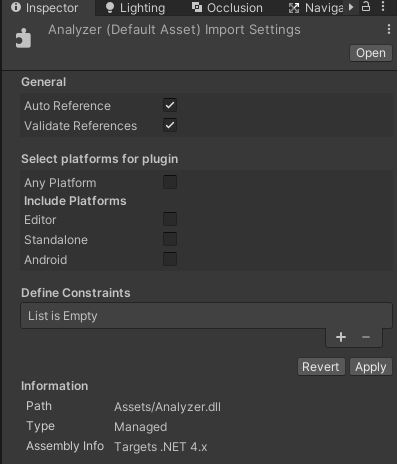
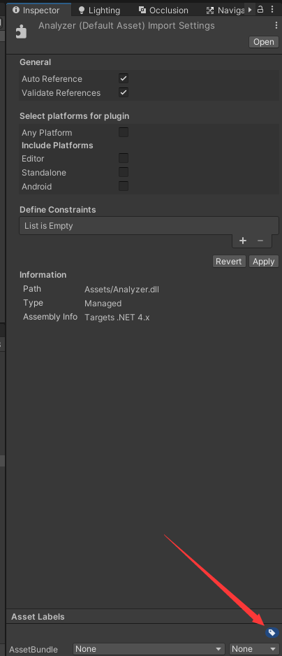
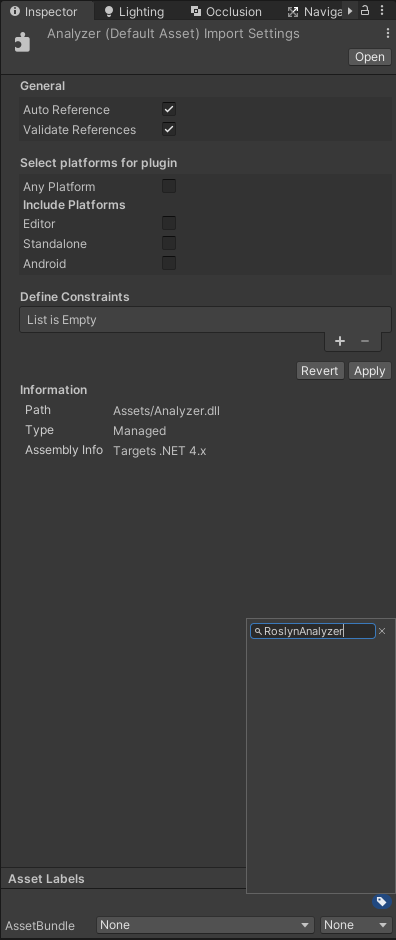

# KEventSystem 

1. 事件使用Attribute进行注册 <***KEventListenerAttribute***>
2. Attribute中传递的类型必须是委托类型，并且放在KEventFlag类下
3. KEventFlag类可以随便放哪里，只要名字相同即可，推荐使用静态类
4. 静态与实例方法皆可进行注册，实例方法需要注意第一个参数必须是实例类型
````
namespace Kdletters.KEventSystem
{    
    public static class KEventFlag
    {
        public delegate void VoidEvent(KEventTest self);

        public delegate void Event1(object obj);

        public delegate void Event2(object obj1, object obj2);
    }
}

public class KEventTest
{
    //实例函数，委托的第一个参数必须是自身
    [KEventListener(typeof(Kdletters.KEventSystem.KEventFlag.VoidEvent))]
    public void TTT()
    {
    }

    //静态函数，函数的参数跟委托一致即可
    [KEventListener(typeof(Kdletters.KEventSystem.KEventFlag.Event1))]
    public static void AAA(object obj)
    {
    }

    //KEventFlag可以在任何地方，只要名字正确即可
    [KEventListener(typeof(KEventFlag.B))]
    public static void BBB(object obj1, object obj2)
    {
    }

    public static class KEventFlag
    {
        public delegate void B(object obj1, object obj2);
    }
}
````
5. 事件的调用使用统一接口 ***KEventSystem.Dispatch***
6. 本事件系统拥有配套分析器，可以在编译期间检测是否编写正确
7. 正常C#工程在.csproj文件内添加以下代码即可加载分析器
````
<ItemGroup>
    <Analyzer Include="DLL文件所在位置"/>
</ItemGroup>
````
8. Unity项目需要将分析器DLL放在Assets目录下，保证分析器覆盖整个项目，然后将DLL按照下方图片进行设置
   




# TODO

* 目前的事件系统使用的是反射，所以性能有些捉鸡，不过只要不是频繁使用，其实影响不大
* 下一步准备用表达式树对事件系统进行优化，表达式树编译过后拥有近乎直接调用函数的性能